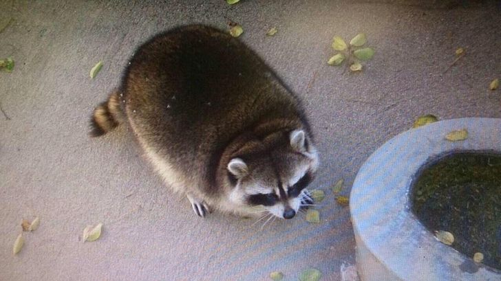
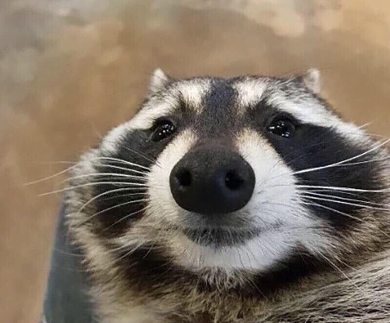

# Angry-kittens
# Большой Енот 
## Средний Енот
### Маленький енот
 
Еноты забавные и милые животные. Окрас его морды напоминает бандитскую маску. Эта маска в полнее характеризует его натуру, он мелкий хулиган и воришка. Часто там, где живут еноты рядом с человеком, они копошатся в мусорках и не редко лазают в дом, чтобы найти что-то съедобное. Поэтому их и считают мелкими бандитами. Но кроме ловкого умения что-нибудь своровать, еноты обладают многими способностями и навыками, которые помогают им выживать в дикой среде и в каменных джунглях.
 

- Текст с точечками
- и еще одна 

1. А тут циферки 
2. тут цифра 2

